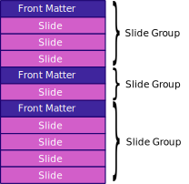

```$
title: "SlideShow Demo"
layout: Title
aspectratio: 4x3
```
# SlideShow - Super fast presentation builder


Press `Down-arrow` to go to the next slide.

```$
layout: SingleColumn
```
# SlideShow


([Attribution](https://commons.wikimedia.org/w/index.php?curid=1592973))

## Definition

According to 
[wikipedia](https://en.wikipedia.org/wiki/Slide_show), 
"A slide show is a presentation of a series of still images
on a projection screen or electronic display device,
typically in a prearranged sequence". 

Press `Down-arrow` to go to the next slide.

```$
title: "The Source file"
layout: SingleColumn
nobreak: true
```
# {{title}}

**The previous slide was made by simply typing the following
content in a regular text file,**

```
# SlideShow


([Attribution](https://commons.wikimedia.org/w/index.php?curid=1592973))

## Definition

According to 
[wikipedia](https://en.wikipedia.org/wiki/Slide_show),
"A slide show is a presentation of a series of still
images on a projection screen or electronic display
device, typically in a prearranged sequence". 

Press `Down-Arrow` to go to the next slide.
```

**Feel free to cross check by going back to the previous
slide by pressing `Up-Arrow`.**

Of course you can also use `Down-Arrow` to go to the next
slide.

```$
layout: SingleColumn
```

# Markdown Format

## The content in the text file is actually in a format called Markdown. 

Markdown is a lightweight and easy-to-use syntax for styling
your writing. You can control the display of the document
such as, 
- Formatting words as **bold** or *italic*
- Adding images
- Creating lists

These are just a few of the things we can do with Markdown.

### Mostly, Markdown is just regular text with a few non-alphabetic characters thrown in, like ``#`` or ``*``.

Markdown has become quite popular lately and you can find
plenty of sites providing tutorial in the internet. 
You can try this 
[site](https://www.markdownguide.org/basic-syntax/) 
to learn Markdown.

```$
layout: TwoColumn
footnote: True
```
# Slides and Navigation
## How do I make multiple slides?  

Do I need to make one text file for each slide? That might
be a lot of files!

Worry no more.

A single Markdown file can contain all your slides. We use
simple and practical ways to break the content into multiple
slides.

- Use top level headings to create new slides.
- Use Front Matter to create a new group of slides in a
  particular layout.

>- > Did you notice that we have switched, just now, the layout to a ***two column*** mode?
>- > It was done with ***Front Matter***.

## Navigating thru the SlideShow presentation is simple
You can use followings to navigate between the pages:  
- `PageUp`, `↑` (`Up-Arrow`), `←` (`Left-Arrow`) keys to go
  backward.  
- `PageDown`, `↓` (`Down-Arrow`), `→` (`Right-Arrow`) keys
  to go forward.  
- `MouseWheel` to go in both directions.
- `swipe-left` and `swipe-right` for mobile and touchscreen
  to go in both directions.

# Front Matter

## Document Organization

* Each SlideShow document consists of one or more Slide
  Groups.
* Each Slide Group consists of a Front Matter and followed
  by one or more slides.
* The Front Matter contains directives to control layout and
  other properties for all the slides in the group.

Front Matter is just a piece of text that looks like the
following,

    ```$
    title: "Say Something Nice"
    logo: logo.jpg
    layout: TwoColumn
    myname: "Henry Bay"
    ```

    
## Structure



```$
layout: SingleColumn
```

# What if?

## I just want a simple presentation!

Do I still need a Front Matter? It sounds like a bit more
work than I need.

You are absolutely right!

So, the answer is, rest assured. 
No, you don't need a Front Matter.
Why should you be penalized for features that you don't use?   

If you didn't put any Front Matter, the SlideShow will treat
your entire SlideShow content as one single Slide Group and
it will apply the default Front Matter to the Slide Group
behind the scene.

Front Matter is necessary only when you want to use multiple
layout styles.

## Default Front Matter

- Will apply a single column layout.
- For every top level heading it will create a new slide.
- Will apply wide screen format, 16x9, the most commonly used aspect ratio.

```$
layout: AutoList
```
# What are the benefits?

## Simple and quick

Build your slides with a text file using any text editor you
have.

Save your content as plain text, SlideShow will do the rest.
Watch your slide getting updated live in the browser,
instantly. No need to hit the refresh button.

Change the aspect ratio? Again SlideShow will update as soon
as you save, instantly. SildeShow will tirelessly monitor
your file!

Single column? Two columns? No problem.

> Did you notice how we are using a progressive subheading layout in this slide?
> Heading to the left, content to the right. It's all automated. No need to
> create all these progressive slides separately and repeat the work.

## Adaptive

The slides are rendered with correct font size automatically
to prevent contents from being clipped.

This is quite nice at times when you have to put a bit more
text than a slide can fit!

## Easy to collaborate

Build a website to share all your up-to-date presentations
quickly.

Everyone has a browser, right?! Well, almost everyone
anyway.

### Mobile and touchscreen support

Swipe to navigate.

## A picture is worth thousand words

You probably are wondering at this point how is this
SlideShow presentation you are watching made? What does the
text file actually look like?

Take a look at the 
<a target="_blank" rel="noopener noreferrer" href="md/chindex.md">`chindex.md`</a> 
file.

This is the actual full Markdown source that created this
presentation,

```$
title: "Getting Started"
layout: SingleColumn
```
# How do I get it? 

Like it what you have seen so far?

Want to give it a try?

## Getting started
You can start building your SlideShow presentation right
now.
Head over to the
<a target="_blank" rel="noopener noreferrer" href="?ch=userman">SlideShow User's Manual</a> 
to learn how to install and use the SlideShow tool.

## Github
Visit our 
[github](https://github.com/kkibria/slideshow-dist) 
repository if you are interested.

---

### Questions, Feedback, Comments, Ideas...
Visit our github 
[discussions](https://github.com/kkibria/slideshow-dist/discussions)
page to say what is in your mind and help build a community
of users.
Your questions are important, this is where they will be
answered.
